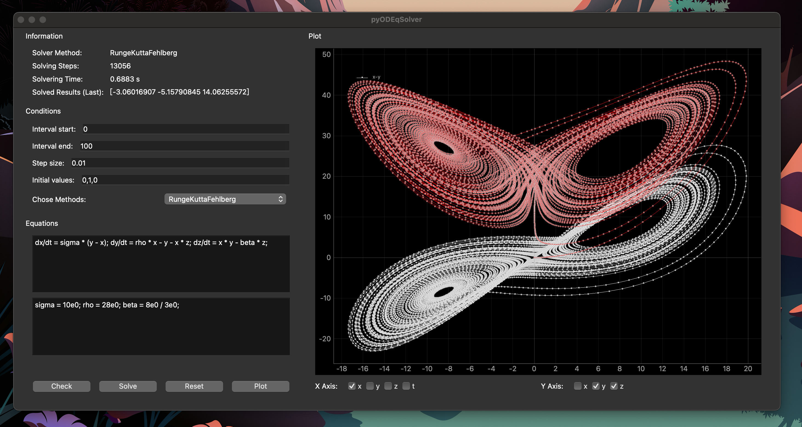
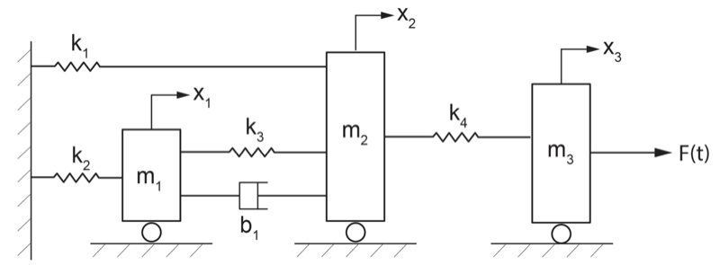
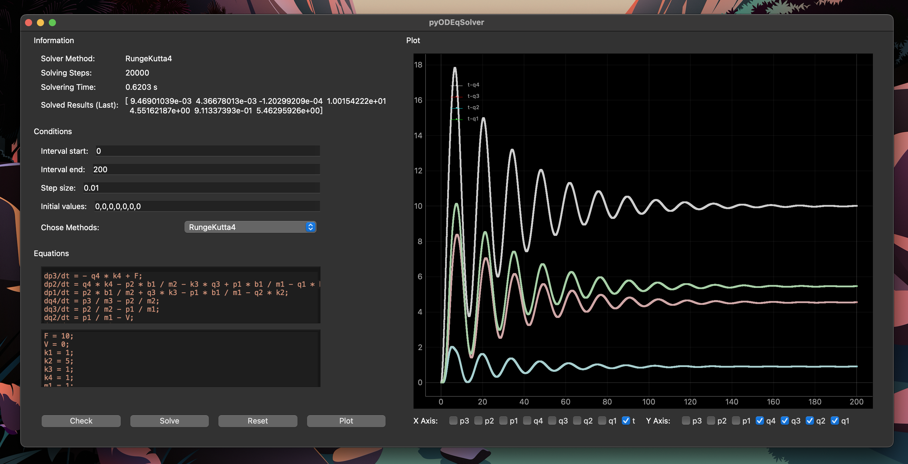
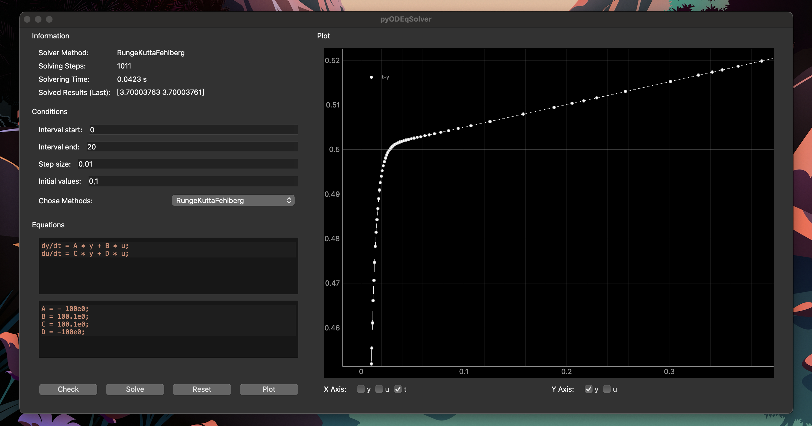

## Python ODE Solver

An ODE solver written in Python aming at solving ordinary differential equations using the string representation. Currently, basic explicit and implicit methods of numerical ODE solver are implemented with Python: forward euler method, forward euler cromer, Runge-Kutta 4, Runge-Kutta-Fehlberg order4/5, backward euler (implicit).

Since solving ODEs with Python is very slow (see [comparision ODE solver implementation comparision](https://github.com/gh-xd/ode_solver_impl_cp)), the implementation in Python only tests the algorithm feasibility (proof-of-concept).

## GUI of pyODESolver

One enters equations and constants with the separation of `;`, set the conditions in GUI, then click the `solve` button to solve the input system of ODEs. To visualize, choose variables of interests (checkboxes) in area `X Axis` and `Y Axis`, then click the `plot` button.

## 3 Examples

### Example 1 - Solving lorenz equations using RKF

### 

### Example 2 - Solving mechanical systems using RK4

The sketch of the mechanical system is shown in picture below. The simple system is 1-dimensional, time-varying and consists of multiple masses, springs and dampers. The system can be described in ODEs.

The picture below illustrates the relation of time to general displacements of springs (k1-k4). For example, the general displacement q4 means the tension/compression of spring k4, etc.

### Example 3 - Some stiff equations using RKF

As the coefficient A, B, C, D imposes the equation with some "quick change" character (like depicted below), the equation performs "stiff". Adaptive step solvers deals with sudden changes very "careful" with small step size.

## Usefullness

The code is not robust, as it is only a playground for studying and practicing ODE solvers. Therefore:

:no_entry_sign: It is not useful for solving serious scientific / engineering ODEs

:white_check_mark: It is more likely a quick visualization tool about some ODEs

:white_check_mark: It is as playground for realizing ODE solver algorithm proof-of-concept

